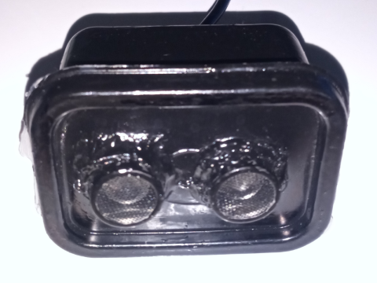
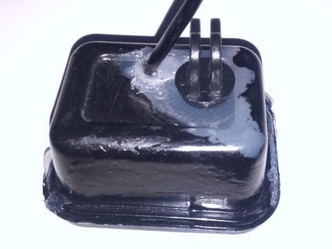

# esp32-bike-computer-back

## Synopsis
This is a companion for esp32-bike-computer-main that sends the distance measured by a HC-SR04 ultrasonic sensor.

This could be used as a parking sensor to show the perfect distance to the wall when you are parking backwards. If you find this completly unuseful there is another reason to have it: Why not?

## Waterproof
I try to use a JSN-SR04T sensor, the waterproof "brother" of the most known HC-SR04, but I could not take any acurate measurements. 

The workarround was keep the sensor and ESP32 inside of a waterproof case, make some holes for the sensor, usb cable and a gopro bracket and seal everything with silicone glue. I'm sure is not the perfect solution, neither is the best finnish, but I have no problem with it under rain or after cleaning the bike.

