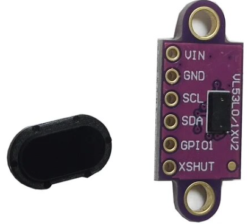

# esp32-bike-computer-back

## Synopsis
This is a companion for esp32-bike-computer-main that sends the distance measured by a VL53L0X laser ToF sensor.

This could be used as a parking sensor to show the perfect distance to the wall when you are parking backwards. If you find this completly unuseful there is another reason to have it: Why not?

## Part list
- **Seeduino Xiao ESP32-C3** 
I have choose this board because is the smallest I could find. The size is only 18mmx18mm.

- **VL53L0X sensor** 
An inexpensive laser ToF sensor with 2m range **with cover.**

- **GoPro mount** 
Choose the one that fits better your setup on the bike. I have choose this one:

## Scheme
The [Fritzing](https://fritzing.org/) scheme is located on the [schemes](schemes) folder. They are designed for soldering on a quick breadboard.

## Waterproof case
I tried to use a JSN-SR04T ultrasonic sensor, the waterproof "brother" of the most known HC-SR04, but I could not take any acurate measurements. 

~~The workarround was keep the sensor and ESP32 inside of a waterproof case, make some holes for the sensor, usb cable and a gopro bracket and seal everything with silicone glue. I'm sure is not the perfect solution, neither is the best finnish, but I have no problem with it under rain or after cleaning the bike.~~

### UPDATE
I have made a 3D printed case for the ESP32-C3 and the VL53L0X sensor. You can find it at [3d_designs](3d_designs) folder.
- Printed on PETG
- 0,3mm layer height
- 100% infill
- No support required

